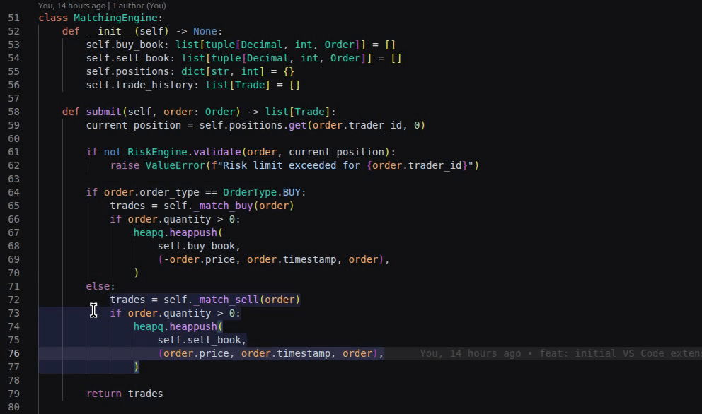

# Code Block Selector

Hover over code to highlight blocks, then Alt+Enter to select, Alt+Up/Down to expand or shrink.

## Features

- **Hover to highlight** — move your cursor over code to highlight the AST block
- **Select** — press Alt+Enter to select the highlighted block
- **Expand / Shrink** — use Alt+Up / Alt+Down to navigate up or down the tree
- **Toggle highlight** — use Alt+Shift+H to enable or disable highlighting
- **Status bar** — shows the current AST node type

## Usage

| Action | Shortcut |
|---|---|
| Select highlighted block | Alt+Enter |
| Expand to parent node | Alt+Up |
| Shrink to child node | Alt+Down |
| Toggle highlighting | Alt+Shift+H |

## Supported Languages

- JavaScript / TypeScript (including JSX/TSX)
- Python
- Go

## Settings

| Setting | Default | Description |
|---|---|---|
| `code-block-selector.highlightColor` | `rgba(100,150,255,0.15)` | Background color for highlighted blocks |
| `code-block-selector.showStatusBar` | `true` | Show AST node type in the status bar |
| `code-block-selector.enabledLanguages` | `["javascript", "typescript", ...]` | Language IDs to enable |

## License

MIT
